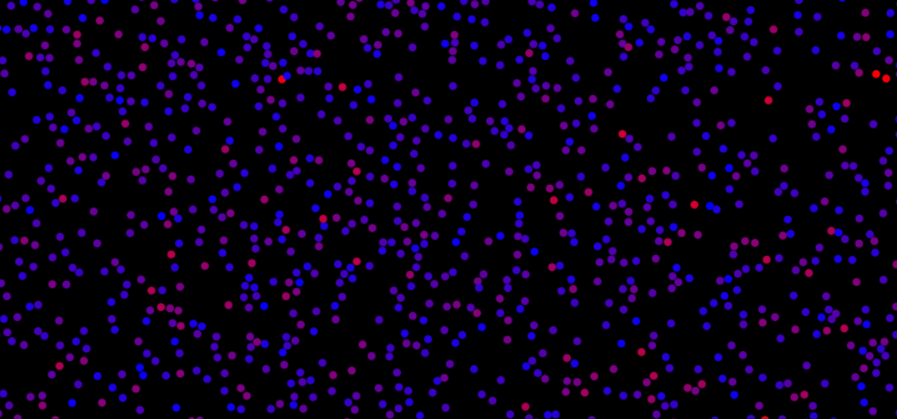

# Kinetic Molecular Theory

A visualization of an adiabatic system modelled by the kinetic molecular theory of gases.

Try it online: [https://mathewkj2048.github.io/kinetic-molecular-theory](https://mathewkj2048.github.io/kinetic-molecular-theory/)

## Features:

- faster molecules have a red tint, slower molecules have a blue tint
- container volume changed by resizing the browser window
- observe phenomena like diffusion, convection and pressure waves
